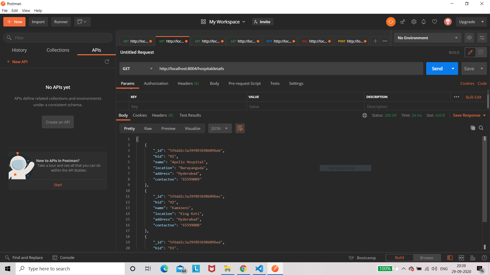
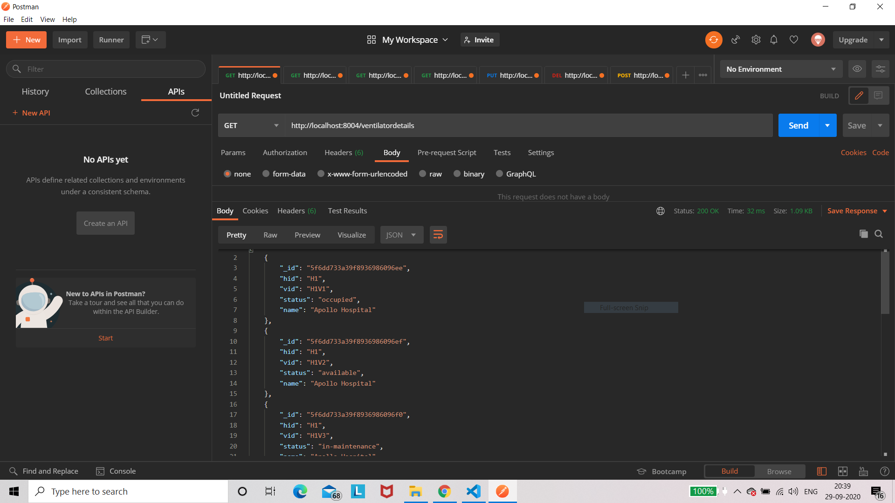
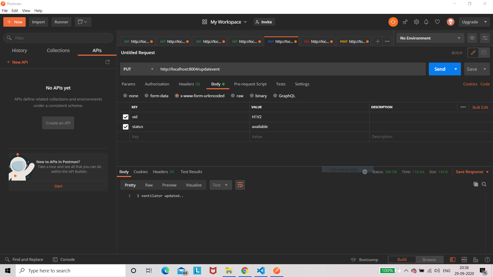

# CRUD API using EXPRESS JS, NODE JS, MONGO DB for Hospital Inventory
 
This repository consists of a project based on CRUD API using Express JS, Node JS, and MongODB for Hospital Inventory.

The db.txt filed contains the database schema and the entries made on our entry database.

The main database is 'hospital' which consists of 2 collections namely 'hospitalInfo' and 'ventilatorInfo'

I have made APIs for 
1) Retrieving Hospitals [GET]  

2) Retrieving Ventilators [GET]  

3) Retrieving ventilators by status [GET]  

4) Retrieving ventilators by hospital names. [GET]   

5) Updating ventilator status using it's vid. [PUT]  

6) Adding a new ventilator [POST]  

7) Deleting a ventilator. [DELETE]  

